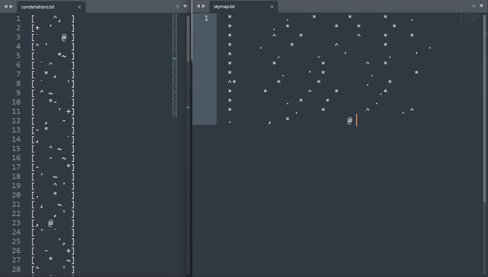
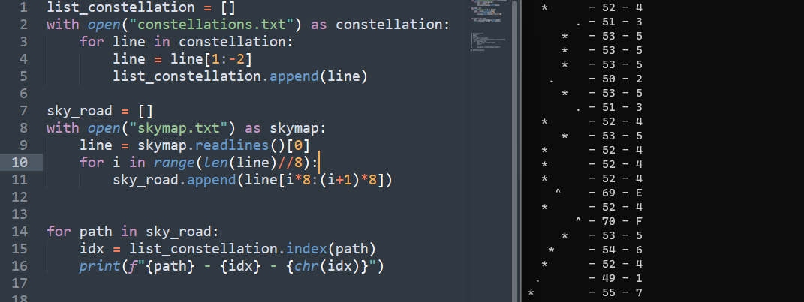

# Paint the sky - 50pts
>"Something is wrong", said Ender to Valentine. "I don't believe it's just a game".
>
>"I know, Ender", Valentine agreed sadly. "However, you've never been to Nekla universe before. We have to learn how to navigate its stars, if you really want to go there. Fortunately, I found some information about it".
>
>Help Ender and Valentine understand Nekla skymap.

Given files: 
- `constellations.txt` - 128 rows of 8-signs in square brackets
- `skymap.txt` - 544 chars, mostly spaces

128 of 8-chars constellation smells like an ASCII (decimal), let's check this trace.

First 8 chars of skymap relates to 53-rd constellation (52nd counting from 0). 52 in ASCII = 4. Good, lets get over whole skymap:

It is not a flag yet, but on 99% it is a HEX ASCII code, because 43 = C, 55 = U, 52 = R...
Final script `sky_decode.py` printed desired flag: `CURSEDNOVA{Sh00t_f0r_the_St4rs_:)}`

