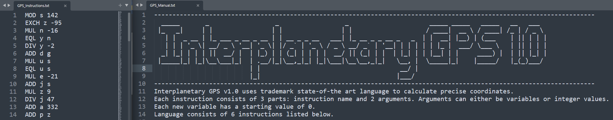
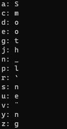

# Manual - 50pts

Required challenge: Navigation

>After two weeks, they have finally reached their destination. They could finally see Planet Rome - and all the war ships surrounding it with open fire. The automatic pilot won't be able to navigate the landing - Ender had to do it by himself.
>
>Because of the constant enemy fire, communication line between the GPS and auto-steering system has been damaged. The best course of action is to jack into the GPS terminal directly, read precise coordinates and shout them to your co-pilot. But wait, the GPS system uses some weird low level code to transmit the data! Thank God there's an old manual book laying around...
>
>After the program has finished running, each variable holds one ASCII value of one letter of the flag. Read each variable as they are in alphabetical order in order to retrieve the flag.
>
>Help Ender land on Planet Rome.

Given:
- `GPS_Instructions.txt` - a list of 421 assembly-based instructions
- `GPS_Manual.txt` - a detailed description of each of six instructions

All that need to be done is a script which will parse instructions, do operations and store data - see `gps_decode.py`.

Output is a little bit distorted:

FLAG: Smooth_landing
