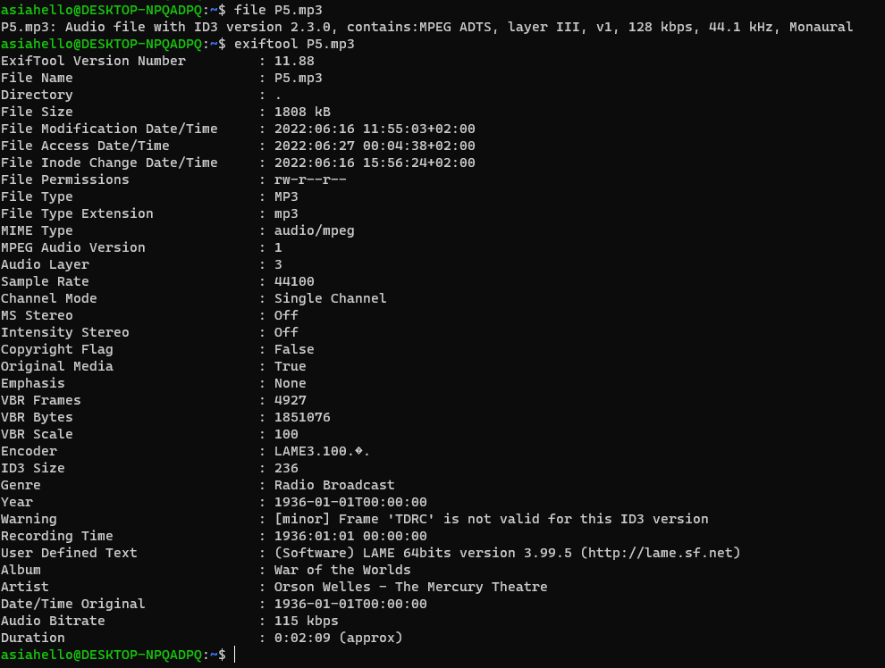
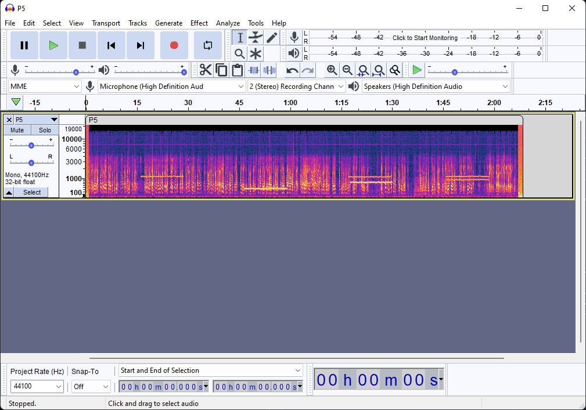
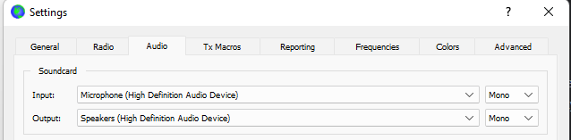
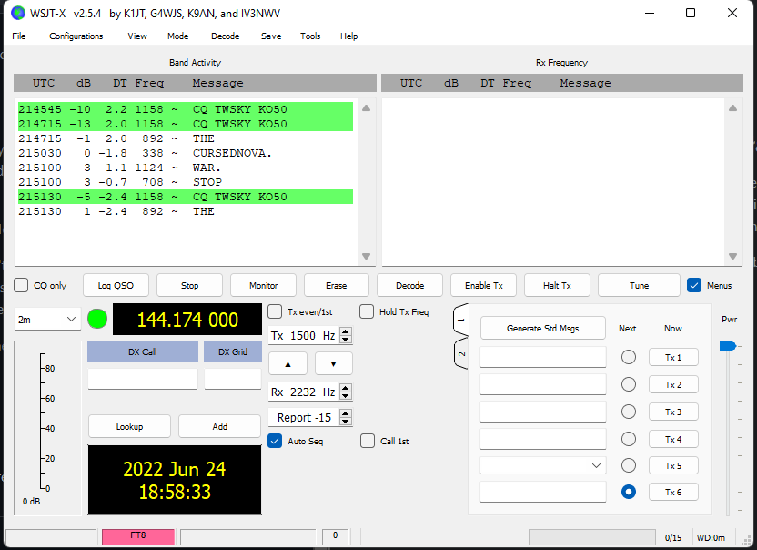

> Ender landed smoothly on what looked like a green desert. The sensors indicated the proper levels of oxygen, so he opened the hatch without putting his helmet on.
>
> Twardowski was waiting for him. His face showed fatigue and concern.
>
> "I believe you're Ender", said Twardowski. "My name is Jan Twardowski. My planet is under attack for almost three weeks now and I'm not sure how long I will hold anymore. They made it a game, you know. To destroy my planet."
>
> Ender nodded. "I had a feeling that CursedNova is not what it looks like. How can I help you?", he asked.
> 
> "The thing is, you can't. I've been living here by myself for 100 years. I can't leave, I can't die. When I was young and ambitious, I made a deal with the Devil. This is my punishment. I guess my simple life here seemed too good for him - so he decided to step up his game and make me miserable again", said Twardowski hopelessly.
>
> Ender looked him in the eye with determination. "I will tell your story to the universe, Twardowski. I will ask them to stop the attack. You can count on me".
>
> They shook hands. Ender turned around and entered his ship.

File to download `P5.mp3`

Ok, this looks like a steganography challenge, so let's start from some basic research: `file`, `exiftool`, `binwalk`:

This is a part of `War of the Worlds` radio broadcast (with quite interesting [story](https://en.wikipedia.org/wiki/The_War_of_the_Worlds_(1938_radio_drama))). Given file differs from the original by a few long beeps. Audacity and a spectogram view shows these beeps very clearly:

It didn't seem familiar to known steganography challenges and any common tool was not helpful to decode the stream. Long time spent on guessing correct parameters of `minimodem` and `Universal Radio Hacker` made it clear that this was not the right way. So I decided to use the hint: `Modulation: 8-FSK, keying rate = 6.25 baud; tone spacing = 6.25 Hz Message length: 75 bits + 12-bit CRC Sequence length: 15 s` which caused this challenge even more confusing. Nothing fit together, except `length: 15s` - beep length, so I just google'd it. And... it was no a hint that describes given file, but a `WSJT-X` program implements many communication protocols (including FT8). By reading manual and watching YT videos, it became clear that this was about decoding radio communication. Opening a file in this program didn't work, so tried to simulate radio communication by playing the file through speakers and listen for microphone:

Volia! I need to repeat experiment twice to catch all singals but this is the effect:

Flag: CURSEDNOVA.STOP THE WAR.
