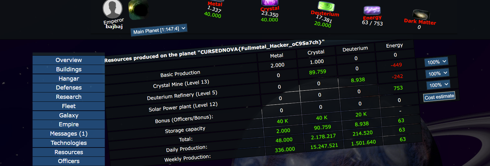

# 1337 - 50pts

>Legend has it that a person who has 1337 metal in their storage will receive a blessing.
>
>Flag: CURSEDNOVA{}, will be visible in the Resources tab.


Quick look at source code to find the condition for the appearance of the flag:

```
if(ceil($PLANET[$resource[901]]) == "1337") {
	$PLANET["name"] = $LNG['W3_1337'];
}
```

It does mean that a flag will appear if I send a request for (or just refresh) a resources tab only if I have 1336 metal at this moment (`ceil`function suggest resurces are not integers).

I've already much more metal than 1337, so I decrease its amount by bulding some stuff,but not a `Metal Mine` - I don't want to mine faster, I need mine \~1 metal per second.



flag: `CURSEDNOVA{Fullmetal_Hacker_oC9Sa7ch}`