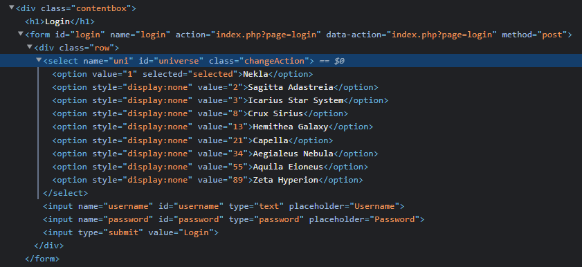
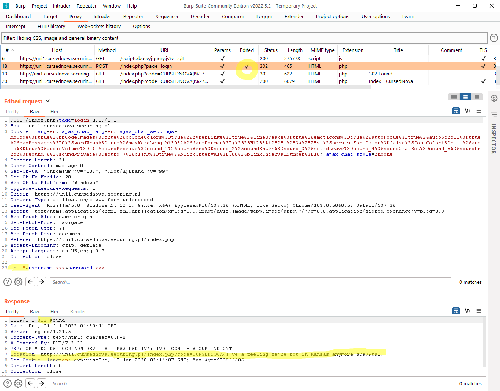

# Hidden Universe - 50pts

>Are we really alone in time and space? Is it only Nekla? Try to discover hidden universes.

There is a login form on a login page and input fields for login, password and universe. Challenge suggests there is more than one universe, but only `Nekla` is available in a form. Let's inspect a HTML:

Other universes are just hidden! Checked registration form, and there are only Nekla available, and creating an account in another universe is impossible, so it have to be something with login page.

Tried to login into some random universes, but no luck, nothing happen. What if it is hidden even more? Just take a closer look in the form to see that values are a Fibonacci sequence, but `5` is missing!

Let's try to add (name is not important here, but I couldn't miss this opportunity):

`<option value="5">Marvel Cinematic Universe</option>`

and on the first look nothing happen, but a quick look again and I was forwarded to:

`https://uni1.cursednova.securing.pl/index.php?code=CURSEDNOVA{I%27ve_a_feeling_we%27re_not_in_Kansas_anymore_wua7Rua1}`

We can do that also in a Burp:

Somehow any login request with `uni=5` is forwarded with code (flag):

`CURSEDNOVA{I've_a_feeling_we're_not_in_Kansas_anymore_wua7Rua1}`