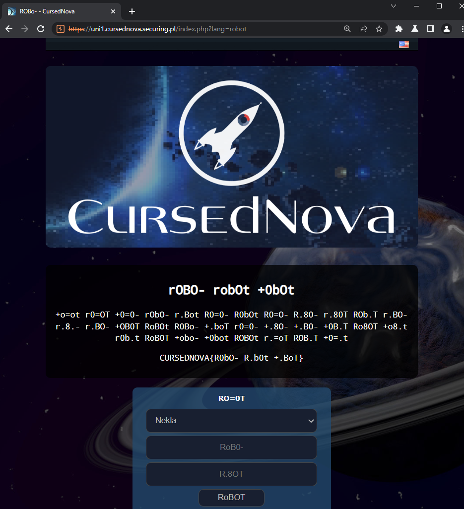

# Robot Language - 50 pts

>Robots don't speak English... Does this app offer any normal languages, like, I don't know, the robot language?!
>
>Flag: CURSEDNOVA{}
>
>This challenge does not require you to build the Robot Factory - but if you have already done it, check out the "Robot Factory" challenge!

This challenge was so simple, but so hard... There are a few places in the game when language can be changed:
- chat language (form with Robot Language)
- language in settings ()
- language in a cookie (`lang=en`)
- flag with language redirect (`https://uni1.cursednova.securing.pl/index.php?lang=en`)

Checked all possible combination, also a real robot language: Robot Interaction Language (ROILA)...

What shall be done:
- remove cookie `lang=en`
- go to page `https://uni1.cursednova.securing.pl/index.php?lang=robot`

FLAG: `CURSEDNOVA{R0bO- R.b0t +.BoT}`