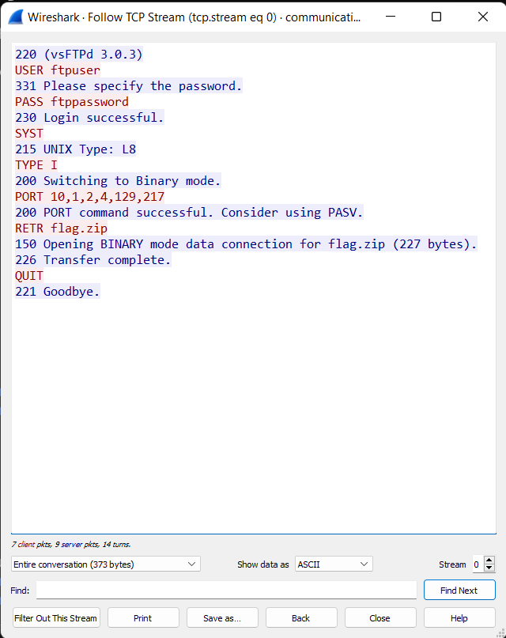

# Communication Breadown - 50 pts beginner

>"I can't do it anymore", thought Twardowski. "Being a prisoner is one thing, I can handle being alone. But these attacks... I don't deserve this. I'm still suffering from a stupid mistake I made two centuries ago..."

Given: `communication_breakdown.pcapng` file shall be opened by Wireshark - the world’s foremost network protocol analyzer. 
This is a record of ~7seconds communication beween two hosts. We can see there following steps:
- login procedure to some ftp server (port 21 - FTP control)
- request of a `flag.zip` file
- response with requested file (port 20 - FTP data transfer)
- 

To see this communication clearly, you can right-click on a first TCP packet, then `Follow -> TCP Stream`. You will see human-readable communication from a TCP stream. Also, there is a display filter set to `tcp.stream eq 0`. Before checking what is hidden in remaining packets, remember to clear display filter at the top of Wireshark to see all communication again. Second stream is a communication with port 20, and did you noticed packet no. 30: `FTP-DATA`? Following this stream we can see some data beginning with `PK` which stands for a zip file, and `flag.txt` is inside. Let's save this stream as zip file and try to capture the flag.

tcp stream 0    |  tcp stream 1
:--------------:|:-------------------------:
  | 

Yup, file is encrypted and we don't know the password so our last hope is bruteforce method. I used `fcrackzip` tool:
`fcrackzip -b -D -p rockyou.txt -u flag.zip`, where:
- `-b` - brute force algorithm
- `-D` - use a dictionary
- `-p rockyou.txt` - publicly available list of common passwords ~14 000 000
- `-u` -  use unzip
and the outhput was:

And that's how to get the first flag: `CURSEDNOVA{FtP_N0t_s0_s4f3_oops}`

