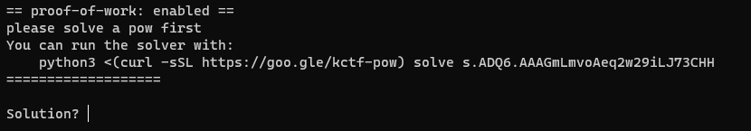
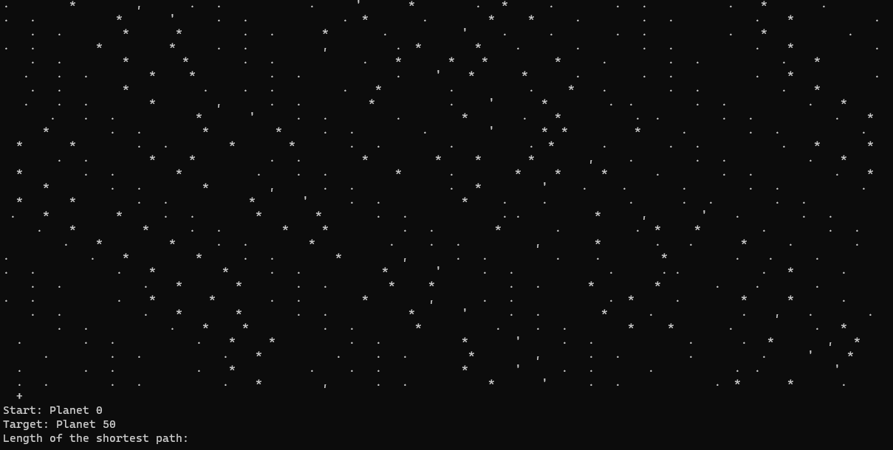
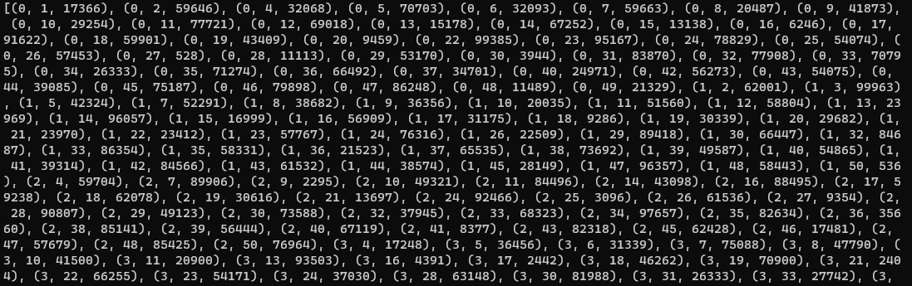

# Navigation - 100 pts

Required challenge: Paint the sky

>"Ender, I have news", said doctor Edsger. "We detected some time anomalies on our way to Planet Rome. If we correct our course, we might arrive there faster".
>
>Help Ender navigate the galaxy. Find the shortest path to his destination.

Given: `tcp://ec2-52-209-66-116.eu-west-1.compute.amazonaws.com:10000`

This was a continuation of `Paint the sky challenge`, so probably this previous task was an introduction to something much more complicated. Let's check: `nc ec2-52-209-66-116.eu-west-1.comput
e.amazonaws.com 10000`

Here we see a [proof-of-work](https://en.wikipedia.org/wiki/Proof_of_work) computation needs to be done before we get the next part. So, opened another console window, run given script and copy paste response. As a  reward I got another riddle with a sky map and a request to provide  length of the shortest path between planet 0 and 50.

How to find planet 0 and planet 50 and a path between them on a 134480-characters map? Let's run previous script using `constellations.txt`. It didn't go smoothly, probably beacause it is not a twice ASCII-decoded test. Removed second translation from script and I got a large graph, which 20% is shown on this screenshot:
. 

Graph + finding the shortest path + Edsger from the plot = Dijkstra!

Putting it all together (but not all was automated) in a `decode_navigation.py` script was necessary, because every time sky map/ graph was different and time to answer was very short.

FLAG: CURSEDNOVA{Dijkstra_through_the_universe}