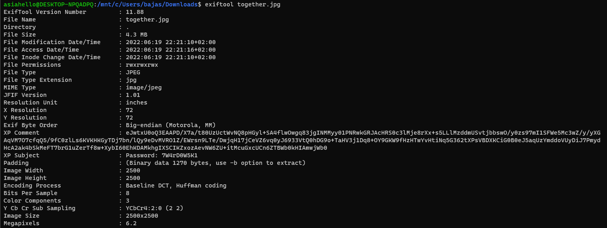
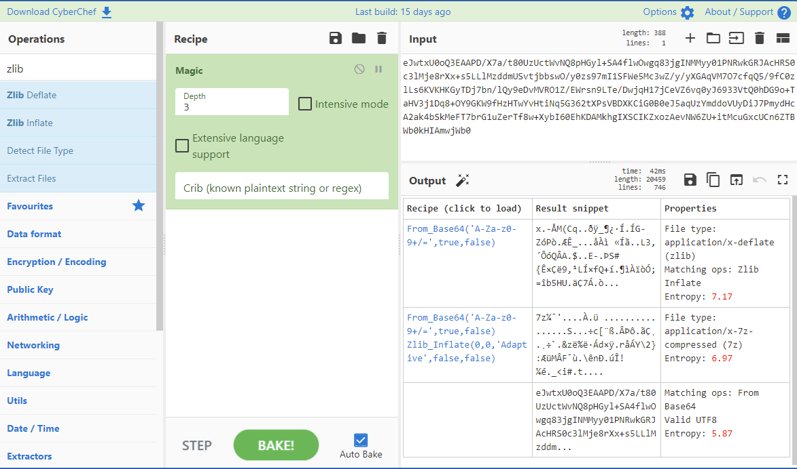
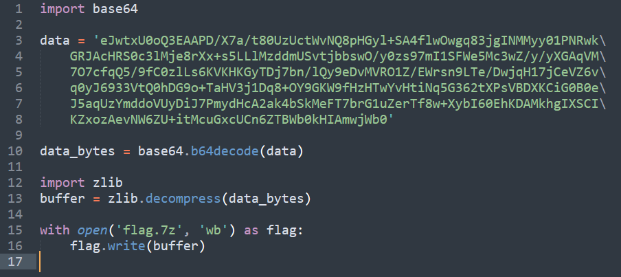

# The Return - 50 pts

>Required challenge: Welcome to CursedNova, The Missile
>
>You didn't have to wait long for Twardowski's ships to appear on your radar. When he got off the spacecraft, you could tell he was incredibly happy.
>
>"You did it! You have beat the devil!", he shouted as soon as he saw you.
>
>"No problem, Twardowski! He fooled me too... And hundreds of other innocent people", you said. "Now tell me... Is there any way to go back to Earth? I miss my family, especially my mom's pierogis".
>
>"How do you think? I had 100 years to come up with a way to return to Earth, and there's nothing my heart desires more", said Twardowski. "Let's go back to my ship".

Given file: `together.jpg`.

Quick look at jpg details gives us a hint. There is certainly something hidden in `XP Comment` and `XP Subject`.

My first hunch - check a zip file. I prefer to use a CyberChef tool for that kind of analysis, especially a `Magic` fuction.
We can see here there this is probably a `zlib` file.

Bunch of tries to resolve this in CyberChef using it's functions failed, but after quick google'ing, it turns out there is a zlib library in Python. `zlib decompression` uncover `7z` encrypted file. Password is known from the first step and we found `flag.txt` with a flag:  `CURSEDNOVA{Home_is_where_the_heart_is}`.

